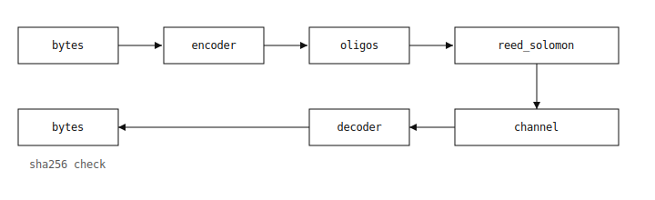

# dna_codec

A DNA-based data storage codec: encode arbitrary bytes into a biologically
valid DNA sequence, fragment it into synthesis-length oligonucleotides,
protect it with Reed-Solomon error correction, simulate a noisy
synthesis/sequencing channel, and decode it back to the original bytes
with SHA-256 integrity verification.

Built and validated in four stages, each with its own test suite
(164 tests, all passing).



## Project layout

```
dna_codec/
├── codec/
│   ├── constraints.py    # Stage 1 — biochemical constraint checking/enforcement
│   ├── encoder.py        # Stage 1 — bytes → constrained DNA sequence
│   ├── oligos.py         # Stage 2 — fragmentation, primers, indexing
│   ├── ecc/
│   │   └── reed_solomon.py   # Stage 3 — RS error correction (row + column)
│   └── decoder.py        # Stage 4 — noisy pool → bytes, with verification
└── channel/
    └── simulator.py      # Stage 3 — synthetic noise model (sub/ins/del/dropout)

tests/
├── test_stage1.py        # constraints + encoder (49 tests)
├── test_stage2.py        # oligos (44 tests)
├── test_stage3.py        # reed_solomon + simulator (33 tests)
└── test_stage4.py        # decoder, full end-to-end pipeline (38 tests)

demo.py                   # runnable end-to-end demonstration
requirements.txt
```

## Installation

```bash
pip install -r requirements.txt
```

The only runtime dependency is [`reedsolo`](https://pypi.org/project/reedsolo/)
(pure-Python Reed-Solomon over GF(2^8)). `pytest` is only needed to run the
test suite.

## Quick start

```bash
python demo.py
```

This runs two scenarios end-to-end and prints the recovered message plus
SHA-256 verification:

1. **With Reed-Solomon ECC** — 8% of oligos are dropped by the simulated
   channel; row + column parity reconstructs the missing oligos and the
   message is recovered byte-for-byte.
2. **Without ECC** — a clean, reordered channel; the decoder reassembles
   the message purely from primer alignment, index recovery, and overlap
   consensus (no RS involved).

Or use the library directly:

```python
from dna_codec.codec.encoder import DNAEncoder
from dna_codec.codec.oligos import OligoPool
from dna_codec.codec.decoder import DNADecoder
from dna_codec.channel.simulator import ChannelSimulator

enc  = DNAEncoder(block_size=200)
pool = OligoPool(oligo_len=150, overlap=20, primer_len=20, index_len=8)

master = enc.encode_bytes(b"hello world")
oligos = pool.fragment(master, enc.start_bases)

sim = ChannelSimulator(dropout_rate=0.05, seed=1)
noisy, stats = sim.simulate(oligos, reorder=True)

dec = DNADecoder(pool, enc)
recovered, report = dec.decode(noisy)

assert recovered == b"hello world"
assert report.sha256_ok
```

## Running the tests

```bash
pytest tests/ -v
```

All 164 tests pass. Slow tests (larger payloads, full pipeline runs) are
marked `@pytest.mark.slow` and run by default; skip them with
`pytest tests/ -m "not slow"` for a faster loop.

## How each stage works

### Stage 1 — Constraints & Encoding (`constraints.py`, `encoder.py`)

DNA synthesis and sequencing are unreliable when a sequence has:
- **GC content** outside roughly 40–60% (destabilizes hybridization),
- **Homopolymer runs** longer than 3 bases (`AAAA...`) (causes indel errors),
- **Long palindromes** (self-complementary substrings that form hairpins).

`constraints.py` checks and enforces these rules. `encoder.py` maps input
bytes to di-bit symbols, then to bases, choosing a rotating "start base"
per block and inserting escape symbols where needed so the resulting DNA
sequence always satisfies the constraints. The process is fully
reversible: `decode_sequence` reconstructs the original bytes and verifies
them against a stored SHA-256 hash.

### Stage 2 — Oligo fragmentation (`oligos.py`)

DNA can't be synthesized as one arbitrarily long molecule — it's split
into oligos of a fixed length (e.g. 150 nt). Each oligo has the structure:

```
5'─[primer_fwd]─[index]─[start_base flag]─[payload]─[primer_rev complement]─3'
```

- **Primers** (20 nt) are generated once per pool and validated for
  melting temperature, GC content, and hairpin risk.
- **Index** (8 nt, base-4 encoded) records the oligo's position, so the
  pool can be reassembled after PCR/sequencing shuffles their order.
- **Payload** consecutive oligos overlap by 20 nt, so a majority-vote
  consensus across neighbours can recover from local errors even without
  ECC.

### Stage 3 — Error correction & channel simulation (`reed_solomon.py`, `simulator.py`)

Two layers of Reed-Solomon protection, RAID-like:

- **Row (per-oligo) parity** — corrects byte errors within a single
  oligo's payload.
- **Column (cross-oligo) parity** — extra "parity oligos" appended to the
  pool let entire dropped oligos be reconstructed, the DNA-storage
  equivalent of RAID-6.

`simulator.py` models a realistic noisy channel: base substitutions,
insertions, deletions, and whole-oligo dropout (failed synthesis or
sequencing coverage gaps), each with independently tunable rates.

### Stage 4 — Decoding (`decoder.py`)

Given a noisy, possibly reordered oligo pool, the decoder:
1. Aligns each oligo via primer matching (tolerant of indels using
   Levenshtein-based alignment),
2. Recovers oligo indices even if the index field itself was corrupted,
3. Reassembles the master sequence using overlap consensus voting,
4. Converts back to bytes and checks the result against the SHA-256 hash
   stored by the encoder.

## Known behaviour / design notes

- **Payload substitutions/indels without RS**: the baseline decode path
  (`DNADecoder.decode` on its own) detects indels during primer alignment
  but relies on overlap consensus, not explicit error-correcting codes,
  to fix payload content. For bit-error correction guarantees, use the RS
  layer (`RSCodec.encode_pool` / `decode_pool`) before the channel step —
  this is the pipeline the "Scenario 1" demo exercises, and it's what the
  Stage 4 test suite explicitly validates as the substitution-correcting
  path (see `test_rs_level1_corrects_substitutions` in `test_stage4.py`).
- **Column parity recovers whole dropped oligos**, not partial corruption
  within a surviving oligo — that's what row (per-oligo) parity is for.
  Use both together for a channel with both dropout and substitutions.
- **Arbitrary binary payloads (images, etc.)**: `DNAEncoder.encode_bytes`
  makes no assumption that the payload is text — any `bytes` object,
  including a PNG/JPEG image, works end-to-end without modification. See
  `examples/image_roundtrip.py` for a runnable CLI demo. Large payloads
  (hundreds or thousands of data oligos) are handled transparently:
  `add_column_parity` stripes the pool into groups sized so each group's
  RS codeword (data + parity symbols) stays within GF(2^8)'s 255-symbol
  limit, and `recover_with_column_parity` reconstructs the same grouping
  during recovery.

## Known limitations (fixed)

Earlier versions of `RSCodec.add_column_parity` / `recover_with_column_parity`
had two bugs that only surfaced with realistic payloads (e.g. an image
large enough to produce hundreds of data oligos):

1. `add_column_parity` built one RS codeword spanning *all* data oligos.
   GF(2^8) limits a codeword to 255 symbols (data + parity), so once
   `N + nsym > 255` (routine for image-sized payloads), `reedsolo` silently
   produced a truncated/corrupt result instead of raising — surfacing much
   later as an `IndexError`. Fixed by striping the pool into
   independently-encoded groups (see above).
2. `recover_with_column_parity` computed `nsym` from the number of
   *surviving* parity oligos instead of the number the codeword was
   originally built with, and passed `erase_pos` using indices relative
   only to the data portion of the codeword rather than the full codeword
   (data + parity). As a result, losing a parity oligo alongside data
   oligos could silently corrupt recovery even when total erasures were
   within RS's theoretical correction capacity. Fixed by recomputing the
   original grouping/`nsym` at recovery time and offsetting erasure
   positions correctly.

Regression tests for both live in `tests/test_stage3.py::TestColumnParityRegressions`.

## References

The constraint models and RS scheme follow established DNA data storage
literature, cited inline in the relevant modules:
- Church, Gao, Kosuri (2012), *Science* — early DNA storage demonstration.
- Grass et al. (2015), *Nature Biotechnology* — GC-content/error-robust encoding.
- Organick et al. (2018), *Nature Biotechnology* — random-access, indexed oligo pools.
- Reed & Solomon (1960), *SIAM J. Applied Mathematics* — the original RS code.
